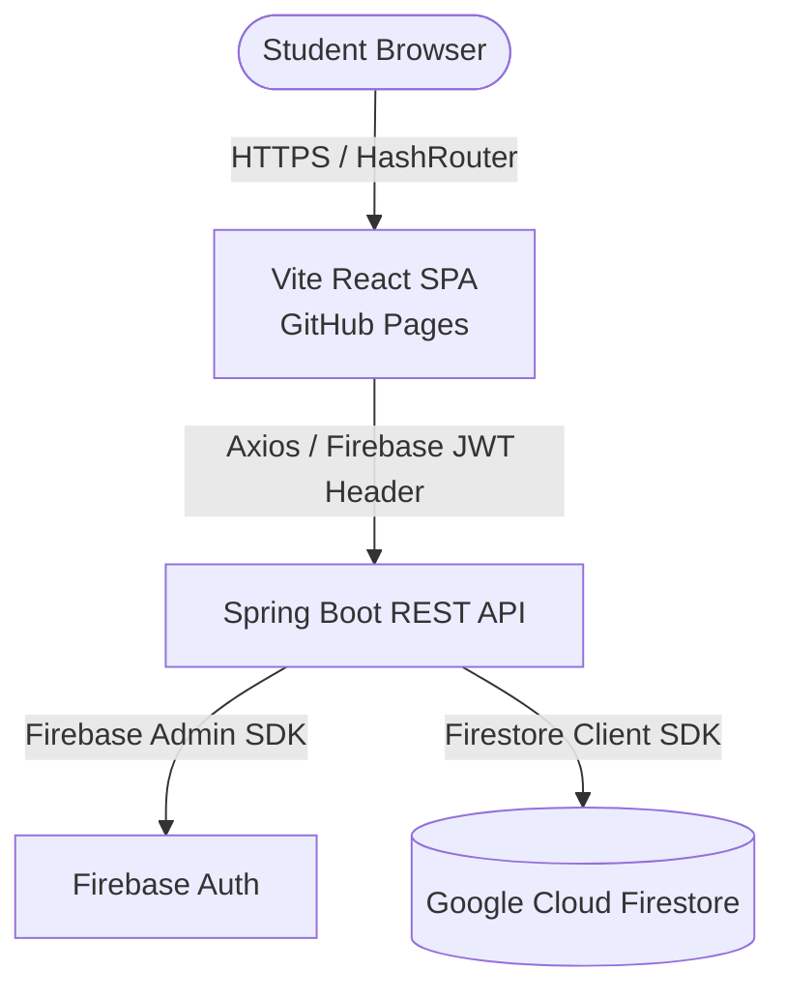

# CampusConnect: Full-Stack Campus Gig Marketplace & E2E Testing Suite

CampusConnect is a secure, modern, full-stack peer-to-peer web application designed for Saveetha University members. It serves as a digital marketplace allowing students to offer freelance services, post campus projects (gigs), recruit multidisciplinary teams, and chat securely.

This repository hosts the web platform, backend REST service, and extensive End-to-End (E2E) automation suites.

---

## 📁 Repository Structure

```directory
web_platform/
├── backend/                  # Spring Boot REST API (Java)
├── frontend/                 # React & Vite SPA (JavaScript)
│   └── selenium-tests/       # Mocha/Node E2E Selenium Test Suite (used for CI/CD)
├── react_web_tests/          # Standalone Python Selenium Test Suite & Report Generator
└── .github/workflows/        # GitHub Actions CI/CD Pipeline (headless testing)
```

---

## 🚀 Key Features

* **🎓 Domain-Restricted Authentication**: User registration and sign-in are strictly restricted to the `@saveetha.com` university email domain.
* **💼 Gig Marketplace Board**: Students can publish gigs, browse openings, submit bids, and track project status (Open, In-Progress, Under Review, Completed).
* **👥 Team Recruitment workspace**: Allows creators to form custom teams, auto-accumulate skills from joined members, and place bids on team gigs.
* **🔍 Freelancer Directory**: Interactive cards showcasing student skills, ratings, hourly rates, and academic departments, with custom bookmarking.
* **💬 Real-Time Chat Rooms**: Peer-to-peer messaging system facilitating direct communication between clients, freelancers, and team coordinators.

---

## 🛠️ Technology Stack & Architecture



### Frontend
* **Core**: React.js, Vite (dev server and optimizer).
* **Routing**: React Router configured with `HashRouter` to prevent server-side routing `404` errors in static environments (GitHub Pages).
* **API Connection**: Axios client equipped with a request interceptor to dynamically inject Firebase JWT ID tokens.

### Backend
* **Core**: Java 17, Spring Boot, Maven.
* **Security**: Spring Security whitelisting public documentation paths, integrated with a custom `OncePerRequestFilter` (`FirebaseTokenFilter`) verifying Firebase JWT tokens on every REST endpoint request.
* **Database**: Google Cloud Firestore (NoSQL Document Store) managing accounts, gigs, bids, and reviews.

### Testing & Automation
* **Local Test Suite (Python)**: Selenium Webdriver + custom Excel report dashboard generator with automated screen capture.
* **CI/CD Test Suite (Node.js)**: Mocha + Selenium Webdriver executing headlessly with automated viewport scaling and custom JavaScript click fallbacks to bypass execution interceptions.

---

## 🔧 Local Development Setup

### Prerequisites
* **Java Development Kit (JDK 17+)**
* **Node.js (v18+)**
* **Python (v3.10+)** (for the Python E2E suite)
* **Google Chrome & ChromeDriver** (matching your Chrome version)

### Step 1: Run the Backend
1. Generate your Firebase Admin private key JSON (`serviceAccountKey.json`) from the Firebase Console.
2. Save it at `web_platform/backend/src/main/resources/serviceAccountKey.json`.
3. Configure your database details inside `application.properties`.
4. Run the application:
   ```bash
   cd backend
   ./mvnw spring-boot:run
   ```
   The API will run on `http://localhost:8080`.

### Step 2: Run the Frontend
1. Add your Firebase web configuration in `frontend/src/config/firebase.js`.
2. Install dependencies and start the dev server:
   ```bash
   cd frontend
   npm install
   npm run dev
   ```
   Open `http://localhost:5173/CampusConnect_web/` in your browser.

---

## 🧪 Running E2E Automated Tests

### Option A: Running the Node.js/Mocha Test Suite
Used primarily for local smoke testing and the CI/CD pipeline.
```bash
cd frontend/selenium-tests
npm install
npm run test
```

### Option B: Running the Python Test Suite & Generating Reports
Executes a highly detailed E2E suite across all 8 modules (Authentication, Gigs, Teams, etc.) and generates a premium styled Excel report (`test_report.xlsx`) detailing Passed/Failed counts and execution benchmarks.

1. Install requirements:
   ```bash
   cd react_web_tests
   pip install -r requirements.txt
   ```
2. Verify settings in `config.py` (pointing to `http://localhost:5173/CampusConnect_web/`).
3. Run the script:
   ```bash
   python run_tests.py
   ```

---

## 📦 Production Deployment

### Frontend (GitHub Pages)
The build and publication are automated using the `gh-pages` wrapper package.
1. Build & Push:
   ```bash
   cd frontend
   npm run deploy
   ```
   The live application will publish to `https://YOUR_USERNAME.github.io/CampusConnect_web/`.

### Backend (CORS Policy)
The CORS mapping in `SecurityConfig.java` is pre-configured to authorize secure calls from your GitHub Pages URL:
```java
configuration.setAllowedOrigins(Arrays.asList(
    "http://localhost:5173",
    "http://127.0.0.1:5173",
    "https://YOUR_USERNAME.github.io"
));
```

### CI/CD Pipeline (GitHub Actions)
The workflow config at `.github/workflows/selenium-login.yml` automatically triggers on every push to `main`. It initializes a headless Ubuntu runner, installs Google Chrome, runs the backend build, and executes the Selenium test suite headlessly to verify login flow stability.
